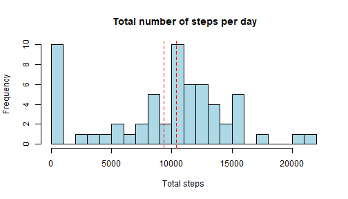
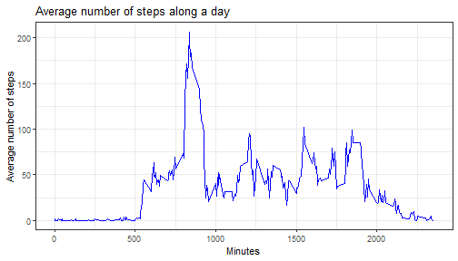

Reproducible Research: Peer Assessment 1
================================================================================ 
## Introduction
It is now possible to collect a large amount of data about personal movement 
using activity monitoring devices such as a Fitbit, Nike Fuelband, or Jawbone 
Up. These type of devices are part of the “quantified self” movement – a group of enthusiasts who take measurements about themselves regularly to improve their health, to find patterns in their behavior, or because they are tech geeks. But these data remain under-utilized both because the raw data are hard to obtain and there is a lack of statistical methods and software for processing and interpreting the data.

This assignment makes use of data from a personal activity monitoring device. 
This device collects data at 5 minute intervals through out the day. The data consists of two months of data from an anonymous individual collected during the months of October and November, 2012 and include the number of steps taken in 5 minute intervals each day.

### Loading and preprocessing the data
The data for this assignment were downloaded from the course web site.


```r
uzData<- unzip("activity.zip")   # unzip the zipped file
activity<-read.csv("activity.csv",na.strings = NA, header = TRUE)
head(activity)
```

```
##   steps       date interval
## 1    NA 2012-10-01        0
## 2    NA 2012-10-01        5
## 3    NA 2012-10-01       10
## 4    NA 2012-10-01       15
## 5    NA 2012-10-01       20
## 6    NA 2012-10-01       25
```
Dataset: Activity monitoring data
The variables included in this dataset are:

- steps: Number of steps taking in a 5-minute interval (missing values are coded
as NA
- date: The date on which the measurement was taken in YYYY-MM-DD format
- interval: Identifier for the 5-minute interval in which measurement was taken

## What is mean total number of steps taken per day?
The total number of steps was grouped daily and total steps per day was calculated using the dplyr package.

```r
library(dplyr)
library(ggplot2)
```

```r
grouppbyDay<-activity %>% group_by(date) %>%
        summarise(total_steps = sum(steps, na.rm = TRUE))
```

```r
hist(grouppbyDay$total_steps, xlab = "Total steps", col = "light blue",
     main = " Total number of steps per day")
```



Here, the mean of the total number of steps taken is 9354.2295082 and the median is 10395.

## What is the average daily activity pattern?
The time series of steps in a day can be determined by taking an average of the steps at each 5-minute interval in all number of days.

```r
groupbyInterval<-activity %>% group_by(interval) %>%
        summarise(average_steps = mean(steps, na.rm = TRUE))
```

```r
g<-ggplot(groupbyInterval, aes(interval, average_steps))
g + geom_line(color = "blue") + labs(x = "Minutes", y = "Average number of steps")+
        labs(title = "Average number of steps along a day") + theme_bw()
```



Here, the number of steps reaches maximum at 835 minutes after taking an average across days.

## Imputing missing values


In the original datasets, there a lot of values in steps column that are missing. The total number of rows missing values of steps are 2304. The missing values can be imputed by filling the NAs with the mean steps in that 5-minute interval across all the days. 


```r
activityImp<-activity %>% group_by(interval) %>%
    mutate(step_new = ifelse(is.na(steps),as.numeric(groupbyInterval[
        which(groupbyInterval$interval==interval),2]),steps))
```

```
## Warning in groupbyInterval$interval == interval: longer
## object length is not a multiple of shorter object length

## Warning in groupbyInterval$interval == interval: longer
## object length is not a multiple of shorter object length

## Warning in groupbyInterval$interval == interval: longer
## object length is not a multiple of shorter object length

## Warning in groupbyInterval$interval == interval: longer
## object length is not a multiple of shorter object length

## Warning in groupbyInterval$interval == interval: longer
## object length is not a multiple of shorter object length

## Warning in groupbyInterval$interval == interval: longer
## object length is not a multiple of shorter object length

## Warning in groupbyInterval$interval == interval: longer
## object length is not a multiple of shorter object length

## Warning in groupbyInterval$interval == interval: longer
## object length is not a multiple of shorter object length

## Warning in groupbyInterval$interval == interval: longer
## object length is not a multiple of shorter object length

## Warning in groupbyInterval$interval == interval: longer
## object length is not a multiple of shorter object length

## Warning in groupbyInterval$interval == interval: longer
## object length is not a multiple of shorter object length

## Warning in groupbyInterval$interval == interval: longer
## object length is not a multiple of shorter object length

## Warning in groupbyInterval$interval == interval: longer
## object length is not a multiple of shorter object length

## Warning in groupbyInterval$interval == interval: longer
## object length is not a multiple of shorter object length

## Warning in groupbyInterval$interval == interval: longer
## object length is not a multiple of shorter object length

## Warning in groupbyInterval$interval == interval: longer
## object length is not a multiple of shorter object length

## Warning in groupbyInterval$interval == interval: longer
## object length is not a multiple of shorter object length

## Warning in groupbyInterval$interval == interval: longer
## object length is not a multiple of shorter object length

## Warning in groupbyInterval$interval == interval: longer
## object length is not a multiple of shorter object length

## Warning in groupbyInterval$interval == interval: longer
## object length is not a multiple of shorter object length

## Warning in groupbyInterval$interval == interval: longer
## object length is not a multiple of shorter object length

## Warning in groupbyInterval$interval == interval: longer
## object length is not a multiple of shorter object length

## Warning in groupbyInterval$interval == interval: longer
## object length is not a multiple of shorter object length

## Warning in groupbyInterval$interval == interval: longer
## object length is not a multiple of shorter object length

## Warning in groupbyInterval$interval == interval: longer
## object length is not a multiple of shorter object length

## Warning in groupbyInterval$interval == interval: longer
## object length is not a multiple of shorter object length

## Warning in groupbyInterval$interval == interval: longer
## object length is not a multiple of shorter object length

## Warning in groupbyInterval$interval == interval: longer
## object length is not a multiple of shorter object length

## Warning in groupbyInterval$interval == interval: longer
## object length is not a multiple of shorter object length

## Warning in groupbyInterval$interval == interval: longer
## object length is not a multiple of shorter object length

## Warning in groupbyInterval$interval == interval: longer
## object length is not a multiple of shorter object length

## Warning in groupbyInterval$interval == interval: longer
## object length is not a multiple of shorter object length

## Warning in groupbyInterval$interval == interval: longer
## object length is not a multiple of shorter object length

## Warning in groupbyInterval$interval == interval: longer
## object length is not a multiple of shorter object length

## Warning in groupbyInterval$interval == interval: longer
## object length is not a multiple of shorter object length

## Warning in groupbyInterval$interval == interval: longer
## object length is not a multiple of shorter object length

## Warning in groupbyInterval$interval == interval: longer
## object length is not a multiple of shorter object length

## Warning in groupbyInterval$interval == interval: longer
## object length is not a multiple of shorter object length

## Warning in groupbyInterval$interval == interval: longer
## object length is not a multiple of shorter object length

## Warning in groupbyInterval$interval == interval: longer
## object length is not a multiple of shorter object length

## Warning in groupbyInterval$interval == interval: longer
## object length is not a multiple of shorter object length

## Warning in groupbyInterval$interval == interval: longer
## object length is not a multiple of shorter object length

## Warning in groupbyInterval$interval == interval: longer
## object length is not a multiple of shorter object length

## Warning in groupbyInterval$interval == interval: longer
## object length is not a multiple of shorter object length

## Warning in groupbyInterval$interval == interval: longer
## object length is not a multiple of shorter object length

## Warning in groupbyInterval$interval == interval: longer
## object length is not a multiple of shorter object length

## Warning in groupbyInterval$interval == interval: longer
## object length is not a multiple of shorter object length

## Warning in groupbyInterval$interval == interval: longer
## object length is not a multiple of shorter object length

## Warning in groupbyInterval$interval == interval: longer
## object length is not a multiple of shorter object length

## Warning in groupbyInterval$interval == interval: longer
## object length is not a multiple of shorter object length

## Warning in groupbyInterval$interval == interval: longer
## object length is not a multiple of shorter object length

## Warning in groupbyInterval$interval == interval: longer
## object length is not a multiple of shorter object length

## Warning in groupbyInterval$interval == interval: longer
## object length is not a multiple of shorter object length

## Warning in groupbyInterval$interval == interval: longer
## object length is not a multiple of shorter object length

## Warning in groupbyInterval$interval == interval: longer
## object length is not a multiple of shorter object length

## Warning in groupbyInterval$interval == interval: longer
## object length is not a multiple of shorter object length

## Warning in groupbyInterval$interval == interval: longer
## object length is not a multiple of shorter object length

## Warning in groupbyInterval$interval == interval: longer
## object length is not a multiple of shorter object length

## Warning in groupbyInterval$interval == interval: longer
## object length is not a multiple of shorter object length

## Warning in groupbyInterval$interval == interval: longer
## object length is not a multiple of shorter object length

## Warning in groupbyInterval$interval == interval: longer
## object length is not a multiple of shorter object length

## Warning in groupbyInterval$interval == interval: longer
## object length is not a multiple of shorter object length

## Warning in groupbyInterval$interval == interval: longer
## object length is not a multiple of shorter object length

## Warning in groupbyInterval$interval == interval: longer
## object length is not a multiple of shorter object length

## Warning in groupbyInterval$interval == interval: longer
## object length is not a multiple of shorter object length

## Warning in groupbyInterval$interval == interval: longer
## object length is not a multiple of shorter object length

## Warning in groupbyInterval$interval == interval: longer
## object length is not a multiple of shorter object length

## Warning in groupbyInterval$interval == interval: longer
## object length is not a multiple of shorter object length

## Warning in groupbyInterval$interval == interval: longer
## object length is not a multiple of shorter object length

## Warning in groupbyInterval$interval == interval: longer
## object length is not a multiple of shorter object length

## Warning in groupbyInterval$interval == interval: longer
## object length is not a multiple of shorter object length

## Warning in groupbyInterval$interval == interval: longer
## object length is not a multiple of shorter object length

## Warning in groupbyInterval$interval == interval: longer
## object length is not a multiple of shorter object length

## Warning in groupbyInterval$interval == interval: longer
## object length is not a multiple of shorter object length

## Warning in groupbyInterval$interval == interval: longer
## object length is not a multiple of shorter object length

## Warning in groupbyInterval$interval == interval: longer
## object length is not a multiple of shorter object length

## Warning in groupbyInterval$interval == interval: longer
## object length is not a multiple of shorter object length

## Warning in groupbyInterval$interval == interval: longer
## object length is not a multiple of shorter object length

## Warning in groupbyInterval$interval == interval: longer
## object length is not a multiple of shorter object length

## Warning in groupbyInterval$interval == interval: longer
## object length is not a multiple of shorter object length

## Warning in groupbyInterval$interval == interval: longer
## object length is not a multiple of shorter object length

## Warning in groupbyInterval$interval == interval: longer
## object length is not a multiple of shorter object length

## Warning in groupbyInterval$interval == interval: longer
## object length is not a multiple of shorter object length

## Warning in groupbyInterval$interval == interval: longer
## object length is not a multiple of shorter object length

## Warning in groupbyInterval$interval == interval: longer
## object length is not a multiple of shorter object length

## Warning in groupbyInterval$interval == interval: longer
## object length is not a multiple of shorter object length

## Warning in groupbyInterval$interval == interval: longer
## object length is not a multiple of shorter object length

## Warning in groupbyInterval$interval == interval: longer
## object length is not a multiple of shorter object length

## Warning in groupbyInterval$interval == interval: longer
## object length is not a multiple of shorter object length

## Warning in groupbyInterval$interval == interval: longer
## object length is not a multiple of shorter object length

## Warning in groupbyInterval$interval == interval: longer
## object length is not a multiple of shorter object length

## Warning in groupbyInterval$interval == interval: longer
## object length is not a multiple of shorter object length

## Warning in groupbyInterval$interval == interval: longer
## object length is not a multiple of shorter object length

## Warning in groupbyInterval$interval == interval: longer
## object length is not a multiple of shorter object length

## Warning in groupbyInterval$interval == interval: longer
## object length is not a multiple of shorter object length

## Warning in groupbyInterval$interval == interval: longer
## object length is not a multiple of shorter object length

## Warning in groupbyInterval$interval == interval: longer
## object length is not a multiple of shorter object length

## Warning in groupbyInterval$interval == interval: longer
## object length is not a multiple of shorter object length

## Warning in groupbyInterval$interval == interval: longer
## object length is not a multiple of shorter object length

## Warning in groupbyInterval$interval == interval: longer
## object length is not a multiple of shorter object length

## Warning in groupbyInterval$interval == interval: longer
## object length is not a multiple of shorter object length

## Warning in groupbyInterval$interval == interval: longer
## object length is not a multiple of shorter object length

## Warning in groupbyInterval$interval == interval: longer
## object length is not a multiple of shorter object length

## Warning in groupbyInterval$interval == interval: longer
## object length is not a multiple of shorter object length

## Warning in groupbyInterval$interval == interval: longer
## object length is not a multiple of shorter object length

## Warning in groupbyInterval$interval == interval: longer
## object length is not a multiple of shorter object length

## Warning in groupbyInterval$interval == interval: longer
## object length is not a multiple of shorter object length

## Warning in groupbyInterval$interval == interval: longer
## object length is not a multiple of shorter object length

## Warning in groupbyInterval$interval == interval: longer
## object length is not a multiple of shorter object length

## Warning in groupbyInterval$interval == interval: longer
## object length is not a multiple of shorter object length

## Warning in groupbyInterval$interval == interval: longer
## object length is not a multiple of shorter object length

## Warning in groupbyInterval$interval == interval: longer
## object length is not a multiple of shorter object length

## Warning in groupbyInterval$interval == interval: longer
## object length is not a multiple of shorter object length

## Warning in groupbyInterval$interval == interval: longer
## object length is not a multiple of shorter object length

## Warning in groupbyInterval$interval == interval: longer
## object length is not a multiple of shorter object length

## Warning in groupbyInterval$interval == interval: longer
## object length is not a multiple of shorter object length

## Warning in groupbyInterval$interval == interval: longer
## object length is not a multiple of shorter object length

## Warning in groupbyInterval$interval == interval: longer
## object length is not a multiple of shorter object length

## Warning in groupbyInterval$interval == interval: longer
## object length is not a multiple of shorter object length

## Warning in groupbyInterval$interval == interval: longer
## object length is not a multiple of shorter object length

## Warning in groupbyInterval$interval == interval: longer
## object length is not a multiple of shorter object length

## Warning in groupbyInterval$interval == interval: longer
## object length is not a multiple of shorter object length

## Warning in groupbyInterval$interval == interval: longer
## object length is not a multiple of shorter object length

## Warning in groupbyInterval$interval == interval: longer
## object length is not a multiple of shorter object length

## Warning in groupbyInterval$interval == interval: longer
## object length is not a multiple of shorter object length

## Warning in groupbyInterval$interval == interval: longer
## object length is not a multiple of shorter object length

## Warning in groupbyInterval$interval == interval: longer
## object length is not a multiple of shorter object length

## Warning in groupbyInterval$interval == interval: longer
## object length is not a multiple of shorter object length

## Warning in groupbyInterval$interval == interval: longer
## object length is not a multiple of shorter object length

## Warning in groupbyInterval$interval == interval: longer
## object length is not a multiple of shorter object length

## Warning in groupbyInterval$interval == interval: longer
## object length is not a multiple of shorter object length

## Warning in groupbyInterval$interval == interval: longer
## object length is not a multiple of shorter object length

## Warning in groupbyInterval$interval == interval: longer
## object length is not a multiple of shorter object length

## Warning in groupbyInterval$interval == interval: longer
## object length is not a multiple of shorter object length

## Warning in groupbyInterval$interval == interval: longer
## object length is not a multiple of shorter object length

## Warning in groupbyInterval$interval == interval: longer
## object length is not a multiple of shorter object length

## Warning in groupbyInterval$interval == interval: longer
## object length is not a multiple of shorter object length

## Warning in groupbyInterval$interval == interval: longer
## object length is not a multiple of shorter object length

## Warning in groupbyInterval$interval == interval: longer
## object length is not a multiple of shorter object length

## Warning in groupbyInterval$interval == interval: longer
## object length is not a multiple of shorter object length

## Warning in groupbyInterval$interval == interval: longer
## object length is not a multiple of shorter object length

## Warning in groupbyInterval$interval == interval: longer
## object length is not a multiple of shorter object length

## Warning in groupbyInterval$interval == interval: longer
## object length is not a multiple of shorter object length

## Warning in groupbyInterval$interval == interval: longer
## object length is not a multiple of shorter object length

## Warning in groupbyInterval$interval == interval: longer
## object length is not a multiple of shorter object length

## Warning in groupbyInterval$interval == interval: longer
## object length is not a multiple of shorter object length

## Warning in groupbyInterval$interval == interval: longer
## object length is not a multiple of shorter object length

## Warning in groupbyInterval$interval == interval: longer
## object length is not a multiple of shorter object length

## Warning in groupbyInterval$interval == interval: longer
## object length is not a multiple of shorter object length

## Warning in groupbyInterval$interval == interval: longer
## object length is not a multiple of shorter object length

## Warning in groupbyInterval$interval == interval: longer
## object length is not a multiple of shorter object length

## Warning in groupbyInterval$interval == interval: longer
## object length is not a multiple of shorter object length

## Warning in groupbyInterval$interval == interval: longer
## object length is not a multiple of shorter object length

## Warning in groupbyInterval$interval == interval: longer
## object length is not a multiple of shorter object length

## Warning in groupbyInterval$interval == interval: longer
## object length is not a multiple of shorter object length

## Warning in groupbyInterval$interval == interval: longer
## object length is not a multiple of shorter object length

## Warning in groupbyInterval$interval == interval: longer
## object length is not a multiple of shorter object length

## Warning in groupbyInterval$interval == interval: longer
## object length is not a multiple of shorter object length

## Warning in groupbyInterval$interval == interval: longer
## object length is not a multiple of shorter object length

## Warning in groupbyInterval$interval == interval: longer
## object length is not a multiple of shorter object length

## Warning in groupbyInterval$interval == interval: longer
## object length is not a multiple of shorter object length

## Warning in groupbyInterval$interval == interval: longer
## object length is not a multiple of shorter object length

## Warning in groupbyInterval$interval == interval: longer
## object length is not a multiple of shorter object length

## Warning in groupbyInterval$interval == interval: longer
## object length is not a multiple of shorter object length

## Warning in groupbyInterval$interval == interval: longer
## object length is not a multiple of shorter object length

## Warning in groupbyInterval$interval == interval: longer
## object length is not a multiple of shorter object length

## Warning in groupbyInterval$interval == interval: longer
## object length is not a multiple of shorter object length

## Warning in groupbyInterval$interval == interval: longer
## object length is not a multiple of shorter object length

## Warning in groupbyInterval$interval == interval: longer
## object length is not a multiple of shorter object length

## Warning in groupbyInterval$interval == interval: longer
## object length is not a multiple of shorter object length

## Warning in groupbyInterval$interval == interval: longer
## object length is not a multiple of shorter object length

## Warning in groupbyInterval$interval == interval: longer
## object length is not a multiple of shorter object length

## Warning in groupbyInterval$interval == interval: longer
## object length is not a multiple of shorter object length

## Warning in groupbyInterval$interval == interval: longer
## object length is not a multiple of shorter object length

## Warning in groupbyInterval$interval == interval: longer
## object length is not a multiple of shorter object length

## Warning in groupbyInterval$interval == interval: longer
## object length is not a multiple of shorter object length

## Warning in groupbyInterval$interval == interval: longer
## object length is not a multiple of shorter object length

## Warning in groupbyInterval$interval == interval: longer
## object length is not a multiple of shorter object length

## Warning in groupbyInterval$interval == interval: longer
## object length is not a multiple of shorter object length

## Warning in groupbyInterval$interval == interval: longer
## object length is not a multiple of shorter object length

## Warning in groupbyInterval$interval == interval: longer
## object length is not a multiple of shorter object length

## Warning in groupbyInterval$interval == interval: longer
## object length is not a multiple of shorter object length

## Warning in groupbyInterval$interval == interval: longer
## object length is not a multiple of shorter object length

## Warning in groupbyInterval$interval == interval: longer
## object length is not a multiple of shorter object length

## Warning in groupbyInterval$interval == interval: longer
## object length is not a multiple of shorter object length

## Warning in groupbyInterval$interval == interval: longer
## object length is not a multiple of shorter object length

## Warning in groupbyInterval$interval == interval: longer
## object length is not a multiple of shorter object length

## Warning in groupbyInterval$interval == interval: longer
## object length is not a multiple of shorter object length

## Warning in groupbyInterval$interval == interval: longer
## object length is not a multiple of shorter object length

## Warning in groupbyInterval$interval == interval: longer
## object length is not a multiple of shorter object length

## Warning in groupbyInterval$interval == interval: longer
## object length is not a multiple of shorter object length

## Warning in groupbyInterval$interval == interval: longer
## object length is not a multiple of shorter object length

## Warning in groupbyInterval$interval == interval: longer
## object length is not a multiple of shorter object length

## Warning in groupbyInterval$interval == interval: longer
## object length is not a multiple of shorter object length

## Warning in groupbyInterval$interval == interval: longer
## object length is not a multiple of shorter object length

## Warning in groupbyInterval$interval == interval: longer
## object length is not a multiple of shorter object length

## Warning in groupbyInterval$interval == interval: longer
## object length is not a multiple of shorter object length

## Warning in groupbyInterval$interval == interval: longer
## object length is not a multiple of shorter object length

## Warning in groupbyInterval$interval == interval: longer
## object length is not a multiple of shorter object length

## Warning in groupbyInterval$interval == interval: longer
## object length is not a multiple of shorter object length

## Warning in groupbyInterval$interval == interval: longer
## object length is not a multiple of shorter object length

## Warning in groupbyInterval$interval == interval: longer
## object length is not a multiple of shorter object length

## Warning in groupbyInterval$interval == interval: longer
## object length is not a multiple of shorter object length

## Warning in groupbyInterval$interval == interval: longer
## object length is not a multiple of shorter object length

## Warning in groupbyInterval$interval == interval: longer
## object length is not a multiple of shorter object length

## Warning in groupbyInterval$interval == interval: longer
## object length is not a multiple of shorter object length

## Warning in groupbyInterval$interval == interval: longer
## object length is not a multiple of shorter object length

## Warning in groupbyInterval$interval == interval: longer
## object length is not a multiple of shorter object length

## Warning in groupbyInterval$interval == interval: longer
## object length is not a multiple of shorter object length

## Warning in groupbyInterval$interval == interval: longer
## object length is not a multiple of shorter object length

## Warning in groupbyInterval$interval == interval: longer
## object length is not a multiple of shorter object length

## Warning in groupbyInterval$interval == interval: longer
## object length is not a multiple of shorter object length

## Warning in groupbyInterval$interval == interval: longer
## object length is not a multiple of shorter object length

## Warning in groupbyInterval$interval == interval: longer
## object length is not a multiple of shorter object length

## Warning in groupbyInterval$interval == interval: longer
## object length is not a multiple of shorter object length

## Warning in groupbyInterval$interval == interval: longer
## object length is not a multiple of shorter object length

## Warning in groupbyInterval$interval == interval: longer
## object length is not a multiple of shorter object length

## Warning in groupbyInterval$interval == interval: longer
## object length is not a multiple of shorter object length

## Warning in groupbyInterval$interval == interval: longer
## object length is not a multiple of shorter object length

## Warning in groupbyInterval$interval == interval: longer
## object length is not a multiple of shorter object length

## Warning in groupbyInterval$interval == interval: longer
## object length is not a multiple of shorter object length

## Warning in groupbyInterval$interval == interval: longer
## object length is not a multiple of shorter object length

## Warning in groupbyInterval$interval == interval: longer
## object length is not a multiple of shorter object length

## Warning in groupbyInterval$interval == interval: longer
## object length is not a multiple of shorter object length

## Warning in groupbyInterval$interval == interval: longer
## object length is not a multiple of shorter object length

## Warning in groupbyInterval$interval == interval: longer
## object length is not a multiple of shorter object length

## Warning in groupbyInterval$interval == interval: longer
## object length is not a multiple of shorter object length

## Warning in groupbyInterval$interval == interval: longer
## object length is not a multiple of shorter object length

## Warning in groupbyInterval$interval == interval: longer
## object length is not a multiple of shorter object length

## Warning in groupbyInterval$interval == interval: longer
## object length is not a multiple of shorter object length

## Warning in groupbyInterval$interval == interval: longer
## object length is not a multiple of shorter object length

## Warning in groupbyInterval$interval == interval: longer
## object length is not a multiple of shorter object length

## Warning in groupbyInterval$interval == interval: longer
## object length is not a multiple of shorter object length

## Warning in groupbyInterval$interval == interval: longer
## object length is not a multiple of shorter object length

## Warning in groupbyInterval$interval == interval: longer
## object length is not a multiple of shorter object length

## Warning in groupbyInterval$interval == interval: longer
## object length is not a multiple of shorter object length

## Warning in groupbyInterval$interval == interval: longer
## object length is not a multiple of shorter object length

## Warning in groupbyInterval$interval == interval: longer
## object length is not a multiple of shorter object length

## Warning in groupbyInterval$interval == interval: longer
## object length is not a multiple of shorter object length

## Warning in groupbyInterval$interval == interval: longer
## object length is not a multiple of shorter object length

## Warning in groupbyInterval$interval == interval: longer
## object length is not a multiple of shorter object length

## Warning in groupbyInterval$interval == interval: longer
## object length is not a multiple of shorter object length

## Warning in groupbyInterval$interval == interval: longer
## object length is not a multiple of shorter object length

## Warning in groupbyInterval$interval == interval: longer
## object length is not a multiple of shorter object length

## Warning in groupbyInterval$interval == interval: longer
## object length is not a multiple of shorter object length

## Warning in groupbyInterval$interval == interval: longer
## object length is not a multiple of shorter object length

## Warning in groupbyInterval$interval == interval: longer
## object length is not a multiple of shorter object length

## Warning in groupbyInterval$interval == interval: longer
## object length is not a multiple of shorter object length

## Warning in groupbyInterval$interval == interval: longer
## object length is not a multiple of shorter object length

## Warning in groupbyInterval$interval == interval: longer
## object length is not a multiple of shorter object length

## Warning in groupbyInterval$interval == interval: longer
## object length is not a multiple of shorter object length

## Warning in groupbyInterval$interval == interval: longer
## object length is not a multiple of shorter object length

## Warning in groupbyInterval$interval == interval: longer
## object length is not a multiple of shorter object length

## Warning in groupbyInterval$interval == interval: longer
## object length is not a multiple of shorter object length

## Warning in groupbyInterval$interval == interval: longer
## object length is not a multiple of shorter object length

## Warning in groupbyInterval$interval == interval: longer
## object length is not a multiple of shorter object length

## Warning in groupbyInterval$interval == interval: longer
## object length is not a multiple of shorter object length

## Warning in groupbyInterval$interval == interval: longer
## object length is not a multiple of shorter object length

## Warning in groupbyInterval$interval == interval: longer
## object length is not a multiple of shorter object length

## Warning in groupbyInterval$interval == interval: longer
## object length is not a multiple of shorter object length

## Warning in groupbyInterval$interval == interval: longer
## object length is not a multiple of shorter object length

## Warning in groupbyInterval$interval == interval: longer
## object length is not a multiple of shorter object length

## Warning in groupbyInterval$interval == interval: longer
## object length is not a multiple of shorter object length

## Warning in groupbyInterval$interval == interval: longer
## object length is not a multiple of shorter object length

## Warning in groupbyInterval$interval == interval: longer
## object length is not a multiple of shorter object length

## Warning in groupbyInterval$interval == interval: longer
## object length is not a multiple of shorter object length

## Warning in groupbyInterval$interval == interval: longer
## object length is not a multiple of shorter object length

## Warning in groupbyInterval$interval == interval: longer
## object length is not a multiple of shorter object length

## Warning in groupbyInterval$interval == interval: longer
## object length is not a multiple of shorter object length

## Warning in groupbyInterval$interval == interval: longer
## object length is not a multiple of shorter object length

## Warning in groupbyInterval$interval == interval: longer
## object length is not a multiple of shorter object length

## Warning in groupbyInterval$interval == interval: longer
## object length is not a multiple of shorter object length

## Warning in groupbyInterval$interval == interval: longer
## object length is not a multiple of shorter object length

## Warning in groupbyInterval$interval == interval: longer
## object length is not a multiple of shorter object length

## Warning in groupbyInterval$interval == interval: longer
## object length is not a multiple of shorter object length

## Warning in groupbyInterval$interval == interval: longer
## object length is not a multiple of shorter object length

## Warning in groupbyInterval$interval == interval: longer
## object length is not a multiple of shorter object length

## Warning in groupbyInterval$interval == interval: longer
## object length is not a multiple of shorter object length

## Warning in groupbyInterval$interval == interval: longer
## object length is not a multiple of shorter object length

## Warning in groupbyInterval$interval == interval: longer
## object length is not a multiple of shorter object length

## Warning in groupbyInterval$interval == interval: longer
## object length is not a multiple of shorter object length

## Warning in groupbyInterval$interval == interval: longer
## object length is not a multiple of shorter object length

## Warning in groupbyInterval$interval == interval: longer
## object length is not a multiple of shorter object length

## Warning in groupbyInterval$interval == interval: longer
## object length is not a multiple of shorter object length

## Warning in groupbyInterval$interval == interval: longer
## object length is not a multiple of shorter object length

## Warning in groupbyInterval$interval == interval: longer
## object length is not a multiple of shorter object length

## Warning in groupbyInterval$interval == interval: longer
## object length is not a multiple of shorter object length

## Warning in groupbyInterval$interval == interval: longer
## object length is not a multiple of shorter object length
```

```r
activityImp
```

```
## # A tibble: 17,568 x 4
## # Groups:   interval [288]
##    steps date       interval step_new
##    <int> <fct>         <int>    <dbl>
##  1    NA 2012-10-01        0   1.72  
##  2    NA 2012-10-01        5   0.340 
##  3    NA 2012-10-01       10   0.132 
##  4    NA 2012-10-01       15   0.151 
##  5    NA 2012-10-01       20   0.0755
##  6    NA 2012-10-01       25   2.09  
##  7    NA 2012-10-01       30   0.528 
##  8    NA 2012-10-01       35   0.868 
##  9    NA 2012-10-01       40   0     
## 10    NA 2012-10-01       45   1.47  
## # ... with 17,558 more rows
```
Now, to check if there are missing values,

```r
anyNA(activityImp$step_new)   #Check for NA values
```

```
## [1] FALSE
```


## Are there differences in activity patterns between weekdays and weekends?
